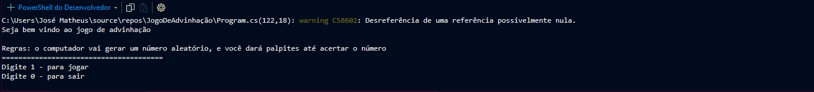

# *Jogo de Adivinhação C#*

# Meu 1° projeto pessoal com C#

## Visão Geral

Objetivo: Criar um jogo de console de advinhação de números, onde os jogadores tem que falar um número de 1 a 100 e o computador vai dizer se esta proximo ou não.

Plataforma: Console .NET

Duração: 5-10 min

Objetivo pessoal: Com esse projeto quero praticar minha lógica de programação e os fundamentos do C#

## Lógica do jogo

Gerar um número aleatório de 1 a 100

Ler se o jogador acertou ou errou o número aleatório

Dar dicas para o jogador como: é mais alto ou é mais baixo

Mostrar quantas tentativas o jogador fez

Nível de dificuldade: fácil: números de 1-24, médio: números de 1-50, dificil: números de 1-100

Perguntar se o jogador quer jogar de novo

## Meus aprendizados

Continue = Faz o loop pular o restante do código que está dentro dele e voltar imediatamente para a próxima iteração (Só funciona em for, while, do-while e foreach)

Console.ResetColor() = reseta as cores do console

int.TryParse() = tenta converter um string digitado por um usuário por um número inteiro, se conseguir retorna TRUE e guardo o valor convertido em uma variável, se não retorna FALSE e evita que o código quebre

return = saí do método e retorna para a função que eu mandar

break = saí de um switch ou loop, mas continua no metodo

## Futuras melhorias

1 Pontuação do jogador

2 Mostrar histórico

3 Modo “multplayer” (revezando jogadores 1 e 2)

4 Limpar tela entre jogadores

5 Comparar pontuações e falar vencedor
